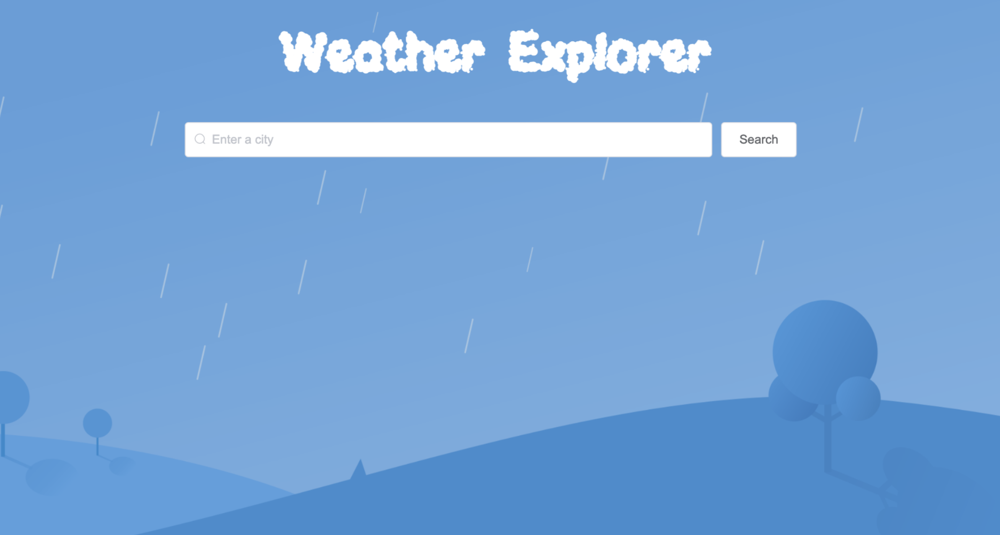
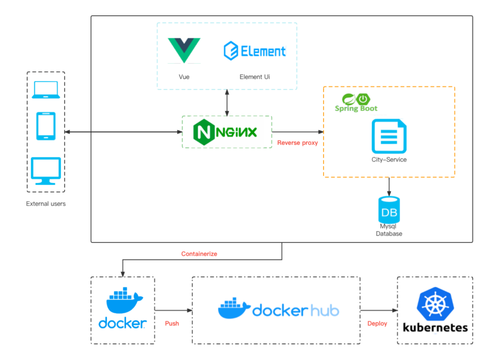
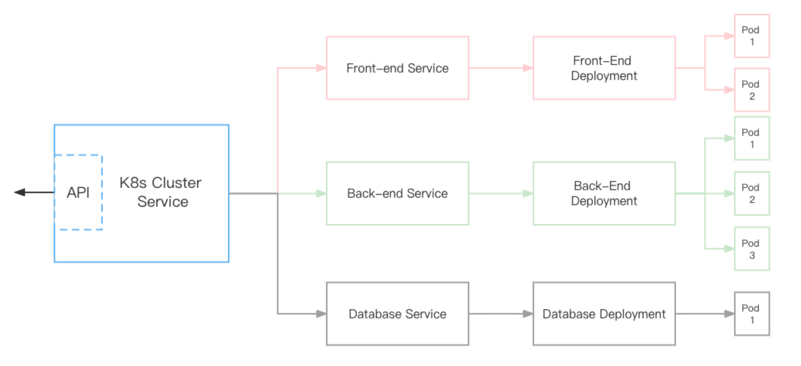
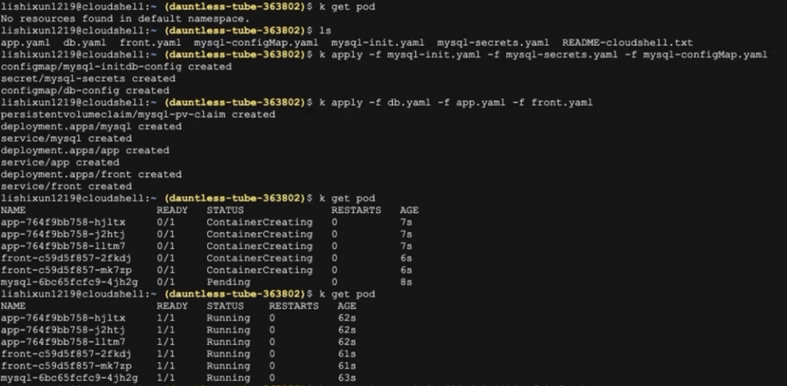
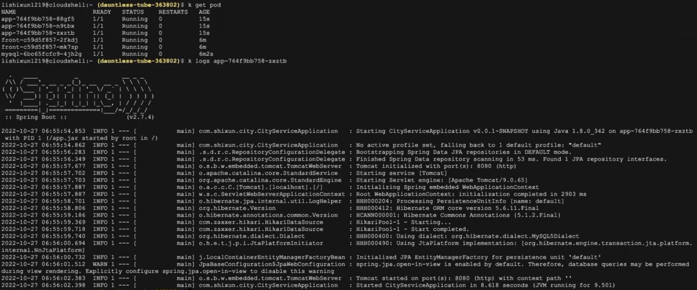
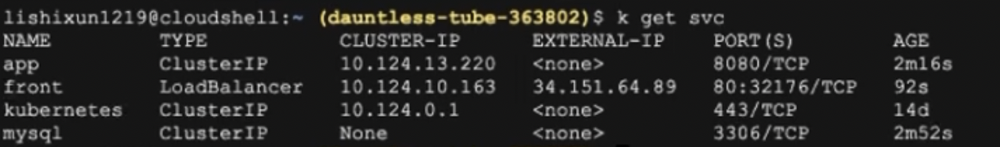
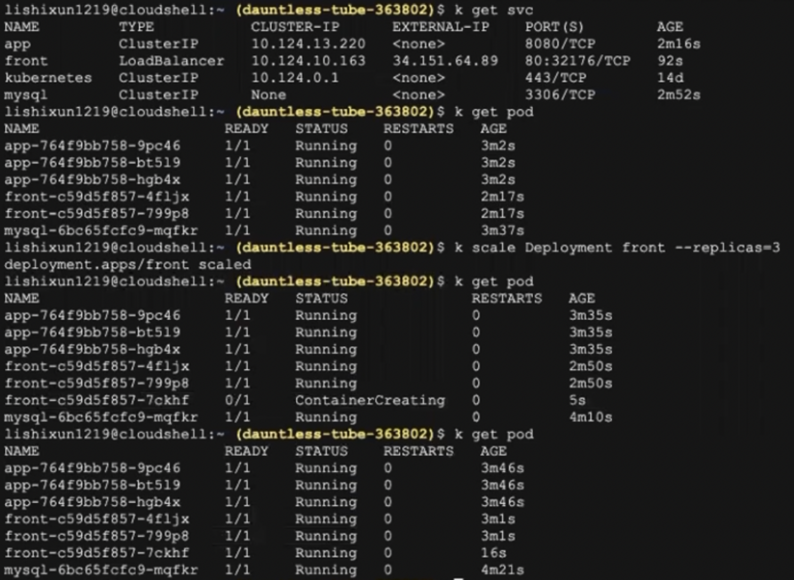
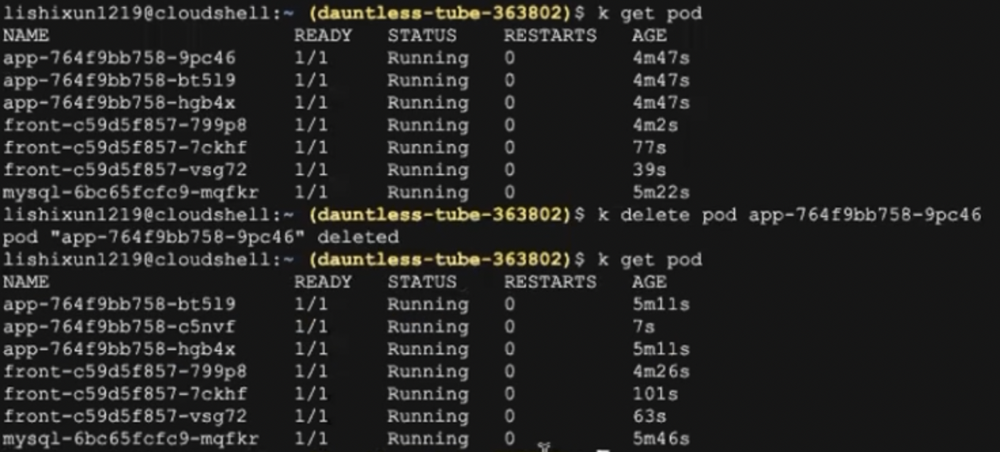
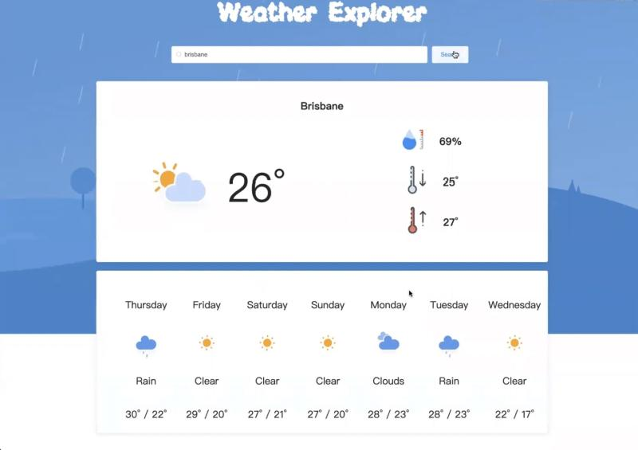

# Weather Explorer

## Introduction

Welcome to Weather Explorer! This repository provides a comprehensive solution for exploring and analyzing weather data from various sources. The project features a dynamic and responsive frontend built with Vue.js, supported by a robust backend powered by **Java Spring Boot**. For deployment, it leverages **Google Kubernetes Engine (GKE)** to ensure high availability and scalability, while **Nginx** serves as the reliable web server and reverse proxy, optimizing performance and load handling across various scenarios.

## Features

- Access real-time weather data from multiple sources
- Visualize weather patterns using interactive charts and maps
- Analyze historical weather data for research or forecasting purposes
- Customize and configure weather data based on your specific needs
- Seamless integration with popular programming languages and frameworks

## Architecture

## Getting Started

### Prerequesties

- A Google Kubernetes Engine (GKE) cluster set up on your GCP
- Kubectl installed
- Docker installed

### Quick Start

1. To get started with Weather Explorer:

   - Access your **Cloud Shell**, clone this repository to your **GKE instance**.

2. In your project directory, run the following command:

    `kubectl apply -f mysql-init.yaml -f mysql-secrects.yaml -f mysql-configMap.yaml ` 

3. Then, create pods for the services:

    `kubectl apply -f db.yaml -f app.yaml -f front.yaml`

4. Check the status of your pods:

   `kubectl get pod`

## Usage

Once you have Weather Explorer up and running, you can explore Kubernetes features:

- Verify that your backend is working by running:

​	` kubectl logs "YOUR-POD-NAME"`

- Check your services, and **visit your website by entering "YOUR-EXTERNAL-IP"** in your browser:

  `kubectl get svc`

- **Scale** your service

  `kubectl scale Deployment "YOUR-POD-NAME" --repicas="NUMBER"`

- **Remove** pods

  `kubectl delete pod "YOUR-POD-NAME"`

## Screenshots

